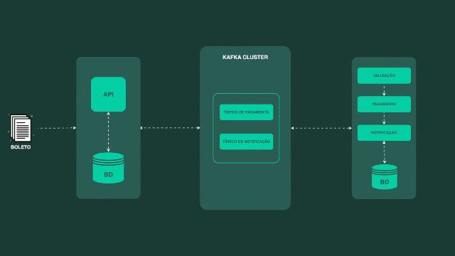

# 📜 Projeto do Curso de Mensageria

**Instrutor:** Luan Rocha

## 🚀 Tecnologias Utilizadas
- **Java**  
- **Spring Boot**  
- **Docker**  
- **Apache Kafka**  
- **Apache Avro**  
- **Control Center**  
- **Schema Registry**  
- **Banco de Dados H2**  

## 🏗️ Arquitetura do Projeto
Este projeto foi desenvolvido como parte do curso de mensageria com Apache Kafka. O foco principal não está na lógica de negócio em si, mas sim no uso do **Kafka** como ferramenta de comunicação assíncrona entre serviços.  

O sistema é composto por aplicações que realizam o **recebimento**, **validação** e **pagamento de boletos**, utilizando **mensageria** para a troca de informações entre os serviços.  

Abaixo está uma ilustração do fluxo de comunicação entre os componentes:  

  

## 🎯 Objetivo
- Demonstrar a configuração e o uso do **Apache Kafka** dentro de um ecossistema de microsserviços.  
- Implementar a **serialização e desserialização** de mensagens com **Apache Avro**.  
- Explorar o **Schema Registry** para garantir a compatibilidade dos eventos.  
- Monitorar e gerenciar os tópicos Kafka através do **Control Center**.  

Este projeto serve como base para aprendizado e prática de mensageria com Kafka, sendo um ótimo ponto de partida para quem deseja se aprofundar nesse conceito.
